<!-- GENERATED by scripts/db/generate-schema-docs.mjs — do not hand-edit. Run: npm run db:schema:docs -->
# Schema relationships — the DB-architect lens

Generated 2026-06-02 from the applied schema. The ER diagrams draw **only enforced foreign keys**, so a
missing relationship ("vazba") is a visibly absent line; each viewpoint lists its unenforced `*_id` gaps.

This is the visualization half of the relationship lens. The enforcement half is the gate
`scripts/db/check-fk-relationship-gaps.mjs` (runs in `verify-cold-start-apply.sh`), whose allowlist
`src/tests/gates/fk-relationship-gaps.allowlist.json` is the full, schema-wide snapshot of pre-existing gaps.
For the full browseable per-table site, run `npm run db:schema:docs -- --tbls` (Docker, output gitignored in `docs/db/tbls/`).

> Regenerate: `AISHA_DB_URL=… npm run db:schema:docs`
## Viewpoint: `stories`

Story domain — partner_stories, its direct FK children, and every story_*-named table.

**32** tables · **36** enforced relationships · **20** unenforced `*_id` gaps.

```mermaid
erDiagram
  consultation_bookings ||--o{ specialist_ratings : "booking_id"
  partner_stories ||--o{ agent_knowledge_bindings : "story_id"
  partner_stories ||--o{ collaboration_preferences : "story_id"
  partner_stories ||--o{ consultation_bookings : "story_id"
  partner_stories ||--o{ graph_nodes : "story_id"
  partner_stories ||--o{ knowledge_attribution : "story_id"
  partner_stories ||--o{ knowledge_items : "story_id"
  partner_stories ||--o{ maintenance_contracts : "story_id"
  partner_stories ||--o{ playwright_runs : "story_id"
  partner_stories ||--o{ project_revenue : "story_id"
  partner_stories ||--o{ rag_eval_golden : "story_id"
  partner_stories ||--o{ rule_quality_feedback : "story_id"
  partner_stories ||--o{ sla_tracking : "story_id"
  partner_stories ||--o{ specialist_ratings : "story_id"
  partner_stories ||--o{ story_ai_sessions : "story_id"
  partner_stories ||--o{ story_bundles : "story_id"
  partner_stories ||--o{ story_entries : "story_id"
  partner_stories ||--o{ story_instances : "story_id"
  partner_stories ||--o{ story_labels : "story_id"
  partner_stories ||--o{ story_links : "source_story_id"
  partner_stories ||--o{ story_links : "target_story_id"
  partner_stories ||--o{ story_matrix_rooms : "story_id"
  partner_stories ||--o{ story_reminders : "story_id"
  partner_stories ||--o{ story_sync_operations : "story_id"
  partner_stories ||--o{ story_sync_policies : "story_id"
  partner_stories ||--o{ voice_rooms : "story_id"
  partner_stories ||--o{ web_artifact_jobs : "story_id"
  partner_stories ||--o{ web_pages : "story_id"
  story_bundles ||--o{ story_sync_operations : "bundle_id"
  story_entries ||--o{ story_entries : "parent_id"
  story_instances ||--o{ story_bundles : "exported_from_instance_id"
  story_instances ||--o{ story_contexts : "active_instance_id"
  story_instances ||--o{ story_sync_operations : "source_instance_id"
  story_instances ||--o{ story_sync_operations : "target_instance_id"
  story_sync_operations ||--o{ story_sync_operations : "parent_operation_id"
  web_pages ||--o{ web_artifact_jobs : "applied_to_page_id"
```

### Unenforced relationships in this viewpoint

`*_id` columns with no FOREIGN KEY constraint (a precision signal says they likely should have one). These are the absent lines above.

| table | column | looks like → |
| --- | --- | --- |
| `consultation_bookings` | `payment_intent_id` | `payment_intent(?)` |
| `graph_nodes` | `source_id` | `source(?)` |
| `knowledge_attribution` | `ai_run_id` | `ai_runs` |
| `knowledge_attribution` | `knowledge_item_id` | `expert_rules,knowledge_items` |
| `knowledge_items` | `author_id` | `users` |
| `knowledge_items` | `expertise_area_id` | `expertise_area(?)` |
| `knowledge_items` | `source_id` | `source(?)` |
| `maintenance_contracts` | `stripe_subscription_id` | `stripe_subscription(?)` |
| `partner_stories` | `github_installation_id` | `github_installation(?)` |
| `partner_stories` | `user_id` | `users` |
| `project_revenue` | `booking_id` | `consultation_bookings` |
| `sla_tracking` | `matrix_room_id` | `matrix_room(?)` |
| `story_ai_sessions` | `focus_actor_id` | `focus_actor(?)` |
| `story_contexts` | `mcp_token_id` | `mcp_token(?)` |
| `story_contexts` | `ruleset_id` | `ruleset(?)` |
| `story_environments` | `deploy_id` | `deploy(?)` |
| `story_environments` | `story_id` | `partner_stories` |
| `story_labels` | `resource_id` | `production_resources` |
| `story_matrix_rooms` | `matrix_room_id` | `matrix_room(?)` |
| `story_rulesets` | `story_id` | `partner_stories` |

