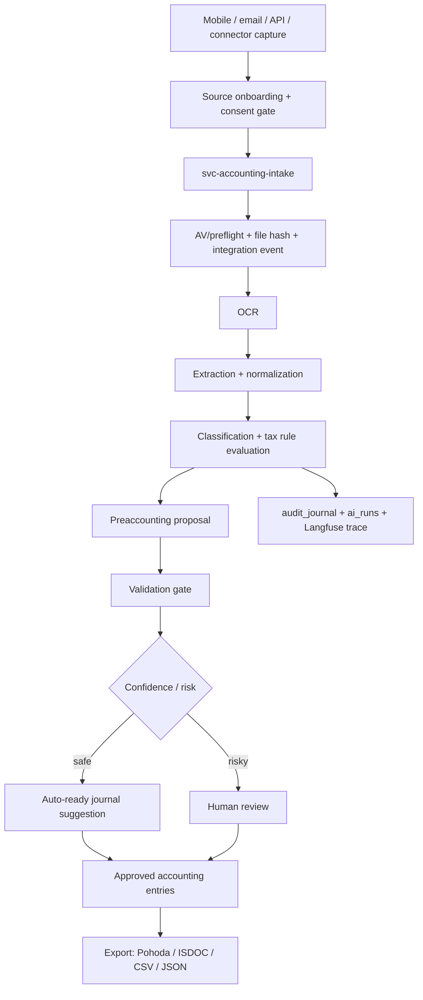

# Krmic -> AISHA accounting protocol blueprint

Status update 2026-07-05: this document remains useful as an inventory and
protocol extraction reference. It is superseded for runtime architecture by
`krmic-bounded-microservice-rag-plan.md`, which recommends Krmic as a bounded
microservice with selective RAG projection instead of deep AISHA DB merge.

Datum: 2026-07-05
Stav: analyza a implementacni navrh, ne pravni stanovisko
Cilova destinace: `<repo-root>`

## Executive summary

Krmic by se do AISHA nemel prenaset jako kopie Supabase Edge Functions. Spravny
tvar je rozdelit ho na:

1. **Pure domain package**: `@aisha/accounting-protocol`
   - normalizovana schemata dokladu,
   - tax/accounting rule evaluator,
   - DPH/CIT rozpad,
   - predkontacni engine,
   - konektorove mapovani bez DB I/O.
2. **AISHA service layer**: `svc-accounting-intake` nebo rozsireni existujicich
   service adapteru
   - mobilni upload, e-mail/API/Pohoda/Fio ingestion,
   - OCR/extract/classify/validate orchestrace,
   - audited RPC-only zapis do Aisha DB.
3. **DB source of truth**: `aisha/db/sql/{enums,tables,functions,rls,indexes}`
   - dokumenty, soubory, polozky, pravidla, DPH zaznamy, predkontace,
   - pouze pres RPC, s RLS, audit_journal, ai_runs a integration_events.
4. **Flowboard capability**:
   - uzly pro capture, OCR, extract, classify, tax-evaluate, preaccount,
     approval, export.
5. **Connector/source adapter layer**:
   - Krmic konektory pretypovat na AISHA SourceAdapter / plugin pattern,
   - Pohoda MDB ponechat jako operator/agent-side adapter, ne jako cloud-only
     server dependency.

Hlavni duvod: Krmic obsahuje hodnotnou doménovou logiku, ale AISHA uz ma
platformove kontrakty pro source onboarding, audit, Flowboard, plugin sandbox,
ai_runs a RPC-only DB pristup. Proto ma byt Krmic v Aishe doménovy protokol a
capability, ne paralelni aplikace.

## Evidence base

### Krmic assets k extrakci

- `supabase/functions/_shared/tax-engine/evaluator.ts`
  - pure evaluator bez DB I/O: pravidla + doklad -> vyhodnoceni.
  - Obsahuje fallback na AI signaly, clamp procent, vypocet DPH ze souctu a
    polozkovy rozpad na uznatelne/neuznatelne castky.
- `supabase/functions/_shared/tax-engine/conditions.ts`
  - genericky condition evaluator: dot-path fields, regex, contains, numeric
    comparisons, `in`, null checks.
- `supabase/functions/_shared/tax-engine/vat-populator.ts`
  - prevod tax eval vysledku na VAT records pro DPH priznani / kontrolni
    hlaseni, vcetne smeru received/supplied, EU/import/export heuristik.
- `supabase/functions/_shared/pipeline-config.ts`
  - per-org stage config pro `ocr|extract|classify|validate`, model, teplotu,
    cost guardrails, prompt hash, debug storePrompt/storeResponse.
- `supabase/functions/process-classify/index.ts`
  - aktualni pipeline spojuje pravidla, AI klasifikaci, uctovou osnovu,
    tax-engine, klasifikacni revize, tax assessment, VAT records a navaznou
    validaci.
- `supabase/functions/process-validate/index.ts`
  - validuje povinna pole, sumu polozek vs hlavicku, low confidence a existenci
    tax assessmentu.
- `apps/mobile/app/scan.tsx`
  - mobilni capture z kamery, galerie, souboru, MIME whitelist, on-device OCR
    preview, upload a live progress.
- `apps/mobile/src/hooks/useDocumentProcessing.ts`
  - realtime progress pres stages `ocr|extract|classify|validate`.
- `packages/connector-pohoda/src/*`
  - pure connector adapter/mappers pro Pohoda MDB: AD, FAP, FAV, UCT, PR_PRC.
  - Dulezite: mappers uz oddeluji read provider od transformace, tedy jsou
    vhodne pro transplantaci do AISHA package.
- `packages/schemas/src/{document,accounting,rule}.ts`
  - Zod kontrakty pro documents, journal entries, chart of accounts a rules.

### AISHA assets, ktere se maji pouzit

- `docs/enterprise/SOURCE_ONBOARDING_CONTRACT.md`
  - kazdy novy source musi mit `source_type`, `data_sensitivity`,
    `retention_class`, `legal_basis`, consent/approval a audit.
- `docs/enterprise/SOURCE_ADAPTER_PATTERN.md`
  - adapter musi delat fetch/validate/normalize, nesmi sahat primo do DB
    tabulek, musi tagovat provenance a pouzivat RPC data products.
- `packages/flowboard-core/src/nodeTypes.ts`
  - Flowboard uz ma `trigger|agent|tool|action|control|gate`, sensitivity
    `public|internal|restricted|confidential`, engine targets `n8n|sandbox`.
- `packages/flowboard-core/src/registry.ts`
  - registry je federovana z builtin, agent_catalog, MCP, n8n a plugin zdroju.
- `aisha/db/sql/tables/ai_runs.sql`
  - kazdy AI run nese `story_id`, cost JSON, metadata a RLS.
- `aisha/db/sql/tables/audit_journal.sql`
  - audit journal uz umi entity, details, old/new values, ai_run_id a
    langfuse trace correlation.
- `aisha/db/sql/functions/record_integration_event.sql`
  - idempotentni integration event dedupe pres `(event_source, external_id)`.
- `services/svc-plugin-system/src/routes/execute.ts`
  - plugin execution jde pres isolated runner, capability validation a audit.
- `services/svc-plugin-system/src/routes/broker.ts`
  - sandbox broker povoluje RPC, KV, governed LLM, notify a https-only fetch
    pres SSRF guard.
- `services/svc-source-broker/src/adapters/source-registry.ts`
  - source adapter dispatchuje podle story, s NullDataSource fallbackem.

## Legal/accounting constraints for CZ MVP

Tyto body nejsou pravni stanovisko; jsou to minimalni systemove constrainty,
podle kterych ma byt protokol navrzen.

- Ucetni doklad musi byt zpracovan tak, aby slo zpetne dohledat oznaceni
  dokladu, obsah pripadu a ucastniky, penize/mnozstvi, datum vyhotoveni,
  okamzik uskutecneni a podpisove/odpovednostni vazby.
  - Source: zakon o ucetnictvi 563/1991 Sb., §11
    - official: https://e-sbirka.gov.cz/sb/1991/563
    - readable reference: https://www.zakonyprolidi.cz/cs/1991-563#p11
- DPH odpocet nesmi byt jen boolean z promptu. Musi byt vazan na ucel pouziti,
  existenci danoveho dokladu, lhuty, pomerne a kracene rezimy.
  - Source: zakon o DPH 235/2004 Sb., zejmena §72, §73, §75, §76
    - official: https://e-sbirka.gov.cz/sb/2004/235
    - readable reference: https://www.zakonyprolidi.cz/cs/2004-235#p72
- Danova uznatelnost musi byt pravidlova a verzovana, ne hardcoded v promptu.
  Zakladni osa je prokazatelna vazba na dosažení, zajištění a udržení prijmu
  a explicitni neuznatelne kategorie.
  - Source: zakon o danich z prijmu 586/1992 Sb., zejmena §24 a §25
    - official: https://e-sbirka.gov.cz/sb/1992/586
    - readable reference: https://www.zakonyprolidi.cz/cs/1992-586#p24

Systemovy dopad: AI muze navrhovat, ale automaticke zauctovani ma projit
verzovanym pravidlem, confidence thresholdem a auditovatelnym approval/gate
krokem, pokud jde o danove riziko, DPH kraceni, reprezentaci, sankce, smiseny
use, reverse-charge, EU/import/export, dlouhodoby majetek nebo nestandardni
predkontaci.

## Target architecture in AISHA



### Package split

#### `packages/accounting-protocol`

Pure TypeScript. Zadny Supabase client, zadny fetch, zadne Deno globals.

Exports:

- `schemas/document`
  - `AccountingDocumentInput`
  - `AccountingDocumentItem`
  - `AccountingParty`
  - `AccountingExtractionResult`
  - `AccountingClassificationResult`
- `rules`
  - condition tree,
  - rule version,
  - jurisdiction,
  - legal references,
  - effects.
- `tax`
  - `evaluateDocument`
  - `buildVatRecords`
  - `summarizeDeductibility`
- `preaccounting`
  - `suggestJournalEntries`
  - `matchPreaccountingTemplate`
  - `scoreAccountingProposal`
- `connectors`
  - mapper interfaces,
  - Pohoda/Fio/email/API canonical mapping helpers.

Why: Toto umozni pouzit stejnou logiku ve Flowboardu, service runtime, tests,
mobile preview, CLI importu i budoucich projektech.

#### `services/svc-accounting-intake`

Fastify service podle AISHA vzoru:

- `applySecurity`
- OTel + metrics
- request size limits
- no raw content logs
- service-role RPC only
- integration event dedupe
- AI runs + audit correlation

Routes:

- `POST /accounting/documents/upload`
- `POST /accounting/documents/:id/ocr`
- `POST /accounting/documents/:id/extract`
- `POST /accounting/documents/:id/classify`
- `POST /accounting/documents/:id/preaccount`
- `POST /accounting/documents/:id/validate`
- `POST /accounting/documents/:id/approve`
- `POST /accounting/exports/:target`

Use service orchestration for heavy work; DB writes only by RPC.

#### `packages/accounting-connectors-*`

- `@aisha/accounting-connector-pohoda`
- `@aisha/accounting-connector-fio`
- `@aisha/accounting-connector-email`
- later `@aisha/accounting-connector-isdoc`

Pohoda MDB needs a local/agent-side reader because MDB filesystem access is not
a normal cloud SaaS connector. Cloud side should receive normalized records,
not raw MDB dependencies.

## DB source-of-truth proposal

V Aishe pridavat do `aisha/db/sql`, ne rucne jen do generated migrations.

### Enums

- `accounting_document_source`
  - `mobile`, `email`, `api`, `web`, `pohoda_mdb`, `fio_bank`, `isdoc`
- `accounting_document_kind`
  - `invoice_received`, `invoice_issued`, `receipt`, `credit_note`,
    `advance_invoice`, `bank_transaction`, `other`
- `accounting_processing_stage`
  - `capture`, `preflight`, `ocr`, `extract`, `normalize`, `classify`,
    `tax_evaluate`, `preaccount`, `validate`, `approve`, `export`
- `accounting_risk_level`
  - `low`, `medium`, `high`, `blocked`
- `accounting_posting_status`
  - `draft`, `suggested`, `review_needed`, `approved`, `posted`, `exported`,
    `rejected`

### Tables

- `accounting_documents`
  - `id`, `story_id`, `owner_user_id`, `organization_ref`, `source`,
    `kind`, `status`, `risk_level`, `document_number`, `issue_date`,
    `taxable_date`, `due_date`, `currency`, `total_amount`, `vat_amount`,
    `counterparty_name`, `counterparty_tax_id`, `counterparty_country`,
    `content_hash`, `metadata`.
- `accounting_document_files`
  - storage pointer, mime, size, sha256, AV/preflight status, OCR source.
- `accounting_document_items`
  - line items, amounts, VAT rate, category, normalized unit data.
- `accounting_extractions`
  - raw OCR text, extracted JSON, model, prompt hash, confidence, schema version.
- `accounting_classifications`
  - category, tags, AI output, applied rules, confidence, warnings.
- `accounting_tax_rules`
  - jurisdiction, rule code, version, valid_from/to, priority, condition tree,
    effects, legal references, status.
- `accounting_tax_assessments`
  - income tax deductible/nondeductible, VAT deductible/nondeductible, matched
    rule codes, legal notes, warnings.
- `accounting_vat_records`
  - direction, tax date, base, tax, rate, VAT code, deductible pct/amount,
    reverse charge/EU/import/export flags.
- `accounting_preaccounting_templates`
  - document kind + supplier/category/rule predicates -> MD/D accounts,
    dimensions, cost center, VAT code, confidence baseline.
- `accounting_journal_suggestions`
  - proposed debit/credit lines, source rule/template/AI, confidence, approval
    state.
- `accounting_connector_external_ids`
  - source system identity mapping, natural-key dedupe, external GUIDs.
- `accounting_exports`
  - batch target, payload hash, external response, exported_at, status.

### RPC contracts

Public/user-facing:

- `create_accounting_document_from_upload_audited(...)`
- `list_my_accounting_documents_audited(...)`
- `get_accounting_document_audited(p_document_id uuid)`
- `approve_accounting_journal_suggestion_audited(...)`
- `reject_accounting_journal_suggestion_audited(...)`

Service-role only:

- `record_accounting_integration_event_service(...)`
- `record_accounting_file_preflight_service(...)`
- `upsert_accounting_ocr_result_service(...)`
- `upsert_accounting_extraction_service(...)`
- `upsert_accounting_classification_service(...)`
- `evaluate_accounting_tax_service(...)`
- `propose_accounting_entries_service(...)`
- `persist_accounting_export_service(...)`

Admin:

- `upsert_accounting_tax_rule_admin(...)`
- `publish_accounting_tax_rule_version_admin(...)`
- `upsert_accounting_preaccounting_template_admin(...)`
- `replay_accounting_document_pipeline_admin(...)`

## Canonical protocol shape

### Input document

```json
{
  "protocol_version": "aisha.accounting.document.v1",
  "source": "mobile|email|api|pohoda_mdb|fio_bank|isdoc",
  "jurisdiction": "CZ",
  "story_id": "uuid",
  "document": {
    "kind": "invoice_received",
    "document_number": "FV-2026-001",
    "issue_date": "2026-07-05",
    "taxable_date": "2026-07-05",
    "due_date": "2026-07-19",
    "currency": "CZK",
    "total_amount": 1210,
    "vat_amount": 210,
    "counterparty": {
      "name": "Dodavatel s.r.o.",
      "tax_id": "CZ12345678",
      "country": "CZ"
    },
    "items": [
      {
        "description": "Software service",
        "quantity": 1,
        "unit_price": 1000,
        "net_amount": 1000,
        "vat_rate": 21,
        "vat_amount": 210,
        "total_amount": 1210
      }
    ]
  },
  "evidence": {
    "file_sha256": "hex",
    "ocr_text_hash": "hex",
    "source_event_id": "uuid"
  }
}
```

### Output assessment

```json
{
  "protocol_version": "aisha.accounting.assessment.v1",
  "status": "suggested|review_needed|blocked",
  "risk_level": "low|medium|high|blocked",
  "confidence": 0.86,
  "tax_assessment": {
    "income_tax_deductible_amount": 1000,
    "income_tax_nondeductible_amount": 0,
    "vat_deductible_amount": 210,
    "vat_nondeductible_amount": 0,
    "matched_rule_codes": ["cz.default.business_expense"],
    "legal_references": ["CZ:586/1992:24", "CZ:235/2004:72"],
    "warnings": []
  },
  "journal_suggestions": [
    {
      "debit_account": "518",
      "credit_account": "321",
      "amount": 1000,
      "vat_account": "343",
      "vat_amount": 210,
      "template_code": "cz.invoice_received.services.standard_vat",
      "confidence": 0.83,
      "requires_review": false
    }
  ],
  "provenance": {
    "ai_run_id": "uuid",
    "audit_journal_id": "uuid",
    "prompt_hash": "16-char-hash",
    "ruleset_version": "CZ-2026-01"
  }
}
```

## Flowboard nodes

Add as plugin/federated descriptors first; promote to builtin only after stable
usage.

- `trigger.accounting_mobile_capture`
  - output: `document`
  - sensitivity: `restricted`
  - capabilities: `accounting.capture`, `document.upload`
- `trigger.accounting_email_inbound`
  - output: `document`
  - sensitivity: `restricted`
- `action.accounting_ocr`
  - input/output: `document`
  - capabilities: `ai.vision`, `accounting.ocr`
- `action.accounting_extract`
  - input/output: `document`
  - capabilities: `ai.extract`, `accounting.extract`
- `action.accounting_classify`
  - input/output: `document`
  - capabilities: `ai.classify`, `accounting.classify`
- `action.accounting_tax_evaluate`
  - input/output: `document`
  - capabilities: `accounting.tax.evaluate`
- `action.accounting_preaccount`
  - input/output: `document`
  - capabilities: `accounting.preaccount`
- `gate.accounting_compliance`
  - input/output: `document`
  - sandbox only, blocks high-risk cases
- `action.accounting_export_pohoda`
  - input: `document`
  - egress: true

## Predkontace strategy

Predkontace nesmi byt jeden prompt. Musi byt slozena z:

1. hard rules / templates,
2. supplier/account history,
3. chart-of-accounts constraints,
4. VAT/tax assessment,
5. AI suggestion only as fallback or scorer.

### MVP template families

- `cz.invoice_received.material`
  - MD 501 / D 321, VAT 343, standard/reduced rate split.
- `cz.invoice_received.services`
  - MD 518 / D 321, VAT 343.
- `cz.invoice_received.travel`
  - MD 512 / D 321 or 211, VAT depending on evidence and use.
- `cz.invoice_received.fuel`
  - MD 501/512 / D 321 or 211, DPH possibly full/partial based on use.
- `cz.invoice_received.representation`
  - nondeductible cost account / D 321 or 211, VAT nondeductible, review gate.
- `cz.invoice_received.penalty`
  - nondeductible, no VAT deduction, high-risk review.
- `cz.invoice_received.asset`
  - fixed asset flow, not direct expense, forced review unless asset template is
    configured.
- `cz.invoice_received.eu_reverse_charge`
  - reverse charge, special VAT records, forced review in MVP.
- `cz.receipt.cash_purchase`
  - MD expense / D 211, VAT based on receipt quality and VAT payer status.
- `cz.credit_note.received`
  - negative correction of original invoice; requires matching.

### Risk gates

Force `review_needed` when:

- confidence below threshold,
- missing document number / issue date / total / counterparty,
- item sum differs from header beyond tolerance,
- no tax assessment exists,
- representation/penalty/private/mixed-use patterns,
- reverse charge, EU acquisition, import/export,
- asset-like purchase,
- VAT payer status unknown,
- supplier mapping conflicts with historical predkontace,
- AI output references account not in active chart of accounts.

## Integration phases

### Phase 0: inventory freeze

- Copy this blueprint into AISHA docs.
- Mark Krmic source files listed above as extraction baseline.
- Decide package names and service boundary.

### Phase 1: pure package

- Create `packages/accounting-protocol`.
- Port tax-engine types/evaluator/conditions/vat-populator to Node ESM.
- Port Zod document/accounting/rule schemas.
- Add unit tests from Krmic patterns.
- No DB, no OpenAI, no Supabase.

### Phase 2: AISHA DB SoT

- Add enums/tables/functions/RLS under `aisha/db/sql`.
- Add RPC tests/gates for:
  - RLS isolation,
  - no direct table access,
  - audit_journal write,
  - integration event idempotency,
  - ai_runs correlation.

### Phase 3: service orchestration

- Add `svc-accounting-intake`.
- Implement upload/preflight/OCR/extract/classify/tax/preaccount/validate.
- Wire cost/spend policy into `ai_runs` and existing AI governance.
- Emit Langfuse/OTel metrics.

### Phase 4: Flowboard + mobile

- Add Flowboard descriptors as plugin provider.
- Add mobile capture integration using AISHA upload/preflight route.
- Progress UI should observe accounting processing runs, not raw service logs.

### Phase 5: connectors and export

- Port Pohoda mappers.
- Add Fio bank transaction ingestion/matching.
- Add export protocols: Pohoda XML, ISDOC, CSV, JSON.
- Add replay/backfill admin RPC.

## Reuse in other projects

The extracted `@aisha/accounting-protocol` should stay independent enough for:

- Cheers: invoice/receipt intake for clinics, supplier spend, Packeta/Stripe fee
  accounting support.
- Tenant/studio: creator/vendor invoices, subscription tax categorization,
  revenue-share settlement support.
- Tyres: inventory purchase invoices, supplier matching, vehicle/fuel/stock cost
  classification.
- ConveySystem: shipment costs, carrier invoices, fuel/travel/logistics expense
  allocation.

Reusable layer is protocol + evaluator + mapper interfaces. Project-specific
layer is templates, chart-of-accounts mapping, connector credentials and
approval policies.

## Non-goals / traps

- Do not import Krmic Supabase Edge Functions directly into AISHA.
- Do not let AI write final journal entries without rule/template provenance.
- Do not store raw OCR text in logs.
- Do not bypass AISHA source onboarding for mobile uploads; user-provided files
  are still data sources.
- Do not collapse DPH and income-tax deductibility into one boolean.
- Do not make Pohoda MDB a cloud runtime dependency.
- Do not use `.from()` from client UI for accounting data; expose audited RPCs.

## Immediate implementation checklist

- [ ] Mirror this document into
      `<repo-root>/docs/integrations/KRMIC_ACCOUNTING_PROTOCOL_BLUEPRINT.md`.
- [ ] Create `packages/accounting-protocol` in AISHA.
- [ ] Port Krmic `tax-engine` pure modules.
- [ ] Add protocol Zod schemas and fixtures.
- [ ] Draft `aisha/db/sql` source-of-truth files for accounting documents and
      processing runs.
- [ ] Add RPC-only audited create/list/get/approve functions.
- [ ] Add Flowboard accounting descriptors.
- [ ] Add service skeleton with OTel/security/metrics.
- [ ] Add first MVP rule set for CZ received invoices.
- [ ] Add golden fixtures: material, services, representation, penalty, fuel,
      mixed-use, EU reverse charge, receipt, credit note.
