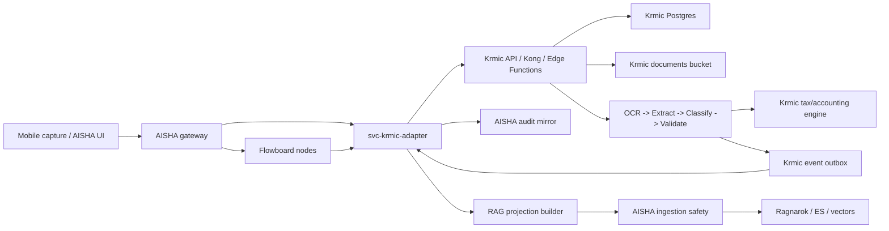

# Krmic as AISHA bounded microservice + selective RAG projection

Date: 2026-07-05

## 1. Executive decision

Recommended architecture:

**Run Krmic as a standalone bounded-context microservice with its own backend,
database, storage, OCR/extract/classify pipeline, tax/accounting protocol,
connectors and exports. Integrate it into AISHA through a thin governed adapter,
event/outbox contracts and a selective RAG projection.**

This replaces the earlier "move the accounting protocol core into AISHA main
repo" direction as the primary strategy. Some pure utilities and schemas can
still be shared later, but the accounting runtime should not become an AISHA
core database module.

Rationale:

- Krmic already owns a full accounting data domain: documents, storage files,
  OCR, extraction, classification, tax engine, VAT records, connector sync,
  exports and org-level RLS.
- AISHA already owns the orchestration substrate: source governance, RAG
  ingestion, Ragnarok, source adapter dispatch, storage proxy patterns and AI
  service routing.
- Accounting law, jurisdiction rules, posting protocols and country-specific
  parameters must be versioned and replaceable. Mixing them into AISHA core
  would make the platform harder to reuse for non-CZ or non-accounting domains.
- Only selected knowledge belongs in vector search. Raw documents and full OCR
  text should stay in Krmic storage by default.

Best variant name:

`Krmic service + AISHA accounting source adapter + RAG projection feed`

## 2. Evidence from current repositories

### 2.1 Krmic is already a service boundary

Verified current assets:

- `Dockerfile` has separate targets for `runner`, `migrate`,
  `functions-init`, `functions`, `kong-custom`, `db-custom`, `storage-init`
  and `vector-custom`.
- `docker-compose.coolify.yml` deploys a self-hosted Supabase stack with
  Postgres, Kong, GoTrue, PostgREST, Realtime, Storage API, Edge Functions,
  Studio, Vector and Logflare-style analytics.
- `coolify/storage-init.sh` creates a private `documents` bucket with allowed
  image/PDF MIME types and org-member RLS policies.
- `supabase/functions/ingest-upload/index.ts` uploads to the `documents`
  bucket, inserts a `documents` row and triggers `process-ocr`.
- `apps/mobile/src/hooks/useDocuments.ts` uploads mobile files into the
  `documents` bucket and creates document records via RPC.
- `apps/mobile/src/hooks/useDocumentProcessing.ts` tracks stages
  `ocr -> extract -> classify -> validate` via `document_processing_runs`.

### 2.2 Krmic contains the accounting intelligence that should remain local

Verified current assets:

- `supabase/functions/process-ocr/index.ts` performs OCR for images and PDFs,
  records per-stage metrics and stores quality signals.
- `supabase/functions/process-extract/index.ts` extracts structured accounting
  data: document type, number, dates, totals, VAT, counterparty, bank details
  and line items.
- `supabase/functions/process-classify/index.ts` combines:
  - organization rules,
  - chart of accounts,
  - AI classification,
  - tax deductibility assessment,
  - VAT deductibility,
  - tax-engine evaluation,
  - document tax assessment persistence,
  - VAT record generation.
- `supabase/functions/_shared/tax-engine/*` is jurisdiction-aware and
  DB-backed. It loads jurisdiction rules, tax rates, categories and generates
  filing outputs.
- Migrations include:
  - `20260508100000_tax_engine_foundation.sql`
  - `20260508100100_tax_engine_seed_cz.sql`
  - `20260509100000_vat_records_extension.sql`
  - `20260509110000_tax_filings.sql`
  - `20260509120000_vat_filing_rpcs.sql`

This is not a thin feature. It is an accounting bounded context.

### 2.3 AISHA already has the right integration surfaces

Verified current AISHA assets:

- `services/gateway/src/routes/functions.ts` routes former edge-function style
  calls to internal microservices. It already routes `ragnarok-search`,
  `ragnarok-upload`, `generate-knowledge-embeddings`,
  `generate-memory-embeddings` and `generate-embeddings`.
- `services/gateway/src/routes/storage.ts` proxies storage traffic through a
  storage-auth service instead of exposing raw object storage.
- `services/svc-aisha-kronos-shim/src/config.ts` and
  `services/svc-aisha-kronos-shim/src/routes/nlp.ts` already treat Ragnarok as
  the RAG backend and default language to `cs-CZ`.
- `services/svc-mcp-knowledge/src/routes/ragnarok.ts` exposes search/upload
  wrappers for Ragnarok and defaults search language to `cs-CZ`.
- `services/svc-mcp-knowledge/src/lib/ingestion-safety.ts` scans ingested
  knowledge for prompt injection and quarantines unsafe content.
- `services/svc-mcp-knowledge/src/lib/embed-dispatcher.ts` supports pluggable
  embedding backends: OpenAI-compatible, direct cloud, local vLLM, LM Studio,
  MCP server and Ollama.
- `packages/insight/ragnarok/ragnarok/index_settings.py` already contains Czech
  analyzers with both accented and unaccented search fields:
  `text`, `text.cs`, `text.cs_ascii`.
- `docs/enterprise/SOURCE_ONBOARDING_CONTRACT.md` and
  `docs/enterprise/SOURCE_ADAPTER_PATTERN.md` define source sensitivity,
  legal basis, retention, namespace isolation, consent, RPC-only access and
  source adapter normalization.
- `services/svc-source-broker/src/adapters/source-registry.ts` dispatches data
  sources by story and keeps unconfigured sources optional through
  `NullDataSource`.

AISHA should consume Krmic as a governed source and capability, not absorb its
entire accounting database.

## 3. Option analysis

| Option | Description | Upside | Downside | Verdict |
| --- | --- | --- | --- | --- |
| A | Deep-merge Krmic tables/functions into AISHA DB | Single DB, simpler direct joins | Couples AISHA core to CZ accounting, large migration risk, harder multi-country support, raw document data leaks into platform scope | Reject |
| B | Extract pure packages only | Reusable schemas/rules | Does not solve storage, OCR jobs, connector sync, audit, long-running processing | Useful later, not enough |
| C | Plugin-only integration | Easy to toggle | Too weak for backend/storage/OCR/tax filing workload | Reject as primary |
| D | Krmic as full standalone product, no AISHA integration except links | Strong isolation | AISHA cannot orchestrate mobile capture, RAG, workflows or cross-project automation | Too isolated |
| E | Krmic bounded microservice + AISHA adapter + event/RAG projection | Clear ownership, reusable across countries, no raw-doc sprawl in AISHA, works with existing RAG/source governance | Requires API contracts, local stack orchestration and contract tests | Recommend |

## 4. Target ownership model

### 4.1 Krmic owns

- Raw document files.
- OCR text and extraction artifacts.
- Document lifecycle and processing runs.
- Counterparties created from documents.
- Accounting classifications and revisions.
- Tax assessment and legal references.
- VAT records, tax filings and filing XML.
- User/org accounting rules.
- Chart of accounts and posting templates.
- Connectors to Pohoda, banks, email and tax submission channels.
- Export formats: Pohoda, ISDOC, CSV, JSON.
- Krmic-specific audit trail and accounting evidence chain.

### 4.2 AISHA owns

- Platform identity and orchestration context.
- Story/source binding and source onboarding governance.
- Flowboard nodes that invoke Krmic.
- Cross-service event routing and status views.
- Knowledge ingestion policy.
- RAG indexing and search over approved projections.
- Platform-level audit mirror of integration calls.
- UI entry points for mobile capture and assistant workflows.

### 4.3 Shared, but not raw-coupled

These can become shared packages only after API contracts are stable:

- Canonical DTO schemas for request/response validation.
- Error code taxonomy.
- Idempotency-key helper.
- Redaction helpers for RAG projection.
- Test fixtures for document lifecycle and posting suggestions.
- Optional country/accounting-pack schema definitions.

Do not share:

- Krmic internal DB schema as AISHA DB migrations.
- Krmic service-role keys.
- Raw OCR corpus by default.
- Country-specific laws as hardcoded AISHA logic.

## 5. Recommended runtime topology



Primary boundary:

- AISHA calls Krmic through `svc-krmic-adapter`.
- Krmic never writes directly into AISHA application tables.
- AISHA never reads Krmic DB directly.
- RAG content enters AISHA only through projection contracts and ingestion
  safety.

## 6. Service contract shape

### 6.1 Identity and tenancy

Every request from AISHA to Krmic must include:

```json
{
  "tenant_id": "aisha-tenant-or-org-id",
  "krmic_organization_id": "uuid-or-external-ref",
  "actor": {
    "type": "user|service",
    "id": "uuid-or-service-name"
  },
  "request_id": "uuid",
  "idempotency_key": "stable-key"
}
```

Authentication options:

- MVP: service-to-service JWT or HMAC signed request from `svc-krmic-adapter`.
- Production: mediated token with scoped permissions, short TTL and audience
  `krmic`.
- Do not pass AISHA service-role secrets into Krmic.

### 6.2 Minimal HTTP API

Krmic should expose a stable facade. It can internally keep Supabase Edge
Functions, but AISHA should not depend on their exact implementation.

Required endpoints:

```text
POST   /v1/documents
GET    /v1/documents/{document_id}
GET    /v1/documents/{document_id}/status
GET    /v1/documents/{document_id}/analysis
POST   /v1/documents/{document_id}/reprocess
POST   /v1/documents/{document_id}/classify
POST   /v1/documents/{document_id}/posting-suggestions
POST   /v1/documents/{document_id}/review
POST   /v1/exports
GET    /v1/exports/{export_id}
GET    /v1/events
POST   /v1/events/ack
GET    /v1/rag/projections
POST   /v1/rag/projections/{projection_id}/ack
```

Optional later:

```text
GET    /v1/accounting-packs
GET    /v1/accounting-packs/{pack_id}/versions
POST   /v1/sandbox/evaluate-document
POST   /v1/sandbox/evaluate-posting
```

### 6.3 Document upload modes

Preferred upload modes:

1. Direct upload to Krmic signed URL, then create document metadata.
2. Multipart upload through `svc-krmic-adapter` for small mobile captures.
3. Import from AISHA storage only when the source already exists in AISHA and
   data processing consent allows transfer.

Do not make AISHA the default raw-file store for accounting documents. It
should hold pointers and integration metadata.

### 6.4 Event contract

Krmic should publish durable outbox events:

```text
krmic.document.created
krmic.document.file_uploaded
krmic.document.ocr_completed
krmic.document.ocr_failed
krmic.document.extraction_completed
krmic.document.classification_completed
krmic.document.validation_completed
krmic.document.review_required
krmic.document.review_approved
krmic.document.posting_suggested
krmic.document.export_completed
krmic.document.rag_projection_ready
```

Event envelope:

```json
{
  "event_id": "uuid",
  "event_type": "krmic.document.classification_completed",
  "occurred_at": "2026-07-05T10:00:00.000Z",
  "organization_id": "uuid",
  "document_id": "uuid",
  "request_id": "uuid",
  "schema_version": "1.0",
  "payload": {
    "status": "classified",
    "confidence": 0.87,
    "requires_review": true
  }
}
```

Delivery:

- MVP: AISHA polls `/v1/events?after=<cursor>`.
- Later: webhook to AISHA with retries and dead-letter queue.
- All events are idempotent by `event_id`.

## 7. RAG/vectorization strategy

### 7.1 Principle

Vectorize only data that improves retrieval and is safe to retrieve.

Default:

- Do not vectorize raw invoices.
- Do not vectorize raw OCR text.
- Do not vectorize full supplier/customer PII.
- Do not vectorize complete accounting ledgers.

Vectorize:

- Public or internal accounting knowledge.
- Versioned accounting-pack explanations.
- Jurisdiction rule summaries with legal references.
- Posting templates and decision trees.
- Sanitized classification rationale.
- Sanitized warnings and review checklists.
- User-approved document snippets for document Q&A, scoped to the same tenant
  and retention class.

### 7.2 Projection types

Krmic should produce projection records, not raw DB dumps.

```typescript
type KrmicRagProjection =
  | "accounting_pack_rule"
  | "posting_template"
  | "tax_assessment_rationale"
  | "review_checklist"
  | "document_summary"
  | "connector_help"
  | "export_mapping";
```

### 7.3 Projection payload

```json
{
  "projection_id": "uuid",
  "source": "krmic",
  "source_id": "krmic:org/document/rule/version",
  "namespace": "tenant_slug/krmic",
  "project_id": "aisha-story-or-project-id",
  "language": "cs-CZ",
  "projection_type": "tax_assessment_rationale",
  "title": "Proc byla cast dokladu neuznatelna",
  "body_markdown": "Sanitizovany text pro RAG...",
  "metadata": {
    "data_sensitivity": "internal",
    "retention_class": "short_term",
    "legal_basis": "contract",
    "jurisdiction": "CZ",
    "ruleset_version": "cz-2026.05.08",
    "document_id": "uuid",
    "redaction_level": "summary_only",
    "contains_raw_ocr": false,
    "contains_personal_data": false,
    "legal_references": ["ZDP", "ZDPH"]
  },
  "source_hash": "sha256",
  "retention_expires_at": "2026-10-05T00:00:00.000Z"
}
```

AISHA ingestion path:

1. `svc-krmic-adapter` fetches projections from Krmic.
2. Adapter validates schema and source onboarding metadata.
3. Adapter rejects disallowed projection types.
4. AISHA ingestion safety scans prompt-injection and dangerous content.
5. Projection enters `knowledge_items` or direct Ragnarok upload path.
6. Embeddings are generated by AISHA RAG pipeline.
7. Retrieval is limited by namespace/story/user permissions.

### 7.4 Czech RAG support

AISHA already has Czech-supporting index settings in Ragnarok:

- base field `text`,
- Czech folded field `text.cs`,
- Czech ASCII-folded field `text.cs_ascii`.

Use that as the primary search substrate. Do not create a parallel Krmic vector
index unless the AISHA/Ragnarok path fails measured acceptance tests.

Required Czech retrieval test set:

```text
DPH vs dan z pridane hodnoty
danove uznatelne vs neuznatelne
uctenka vs faktura vs doklad
ICO vs IC vs identifikacni cislo
DIC vs danove identifikacni cislo
najemne vs najemneho
pojisteni vs pojistne
reprezentace vs obcerstveni
pohonne hmoty vs PHM
kontrolni hlaseni vs KH
predkontace vs uctovani
```

For every fixture, test:

- query with diacritics,
- query without diacritics,
- inflected Czech form,
- abbreviated business term,
- synonym phrase,
- negative query that must not retrieve unrelated tenant data.

### 7.5 Local RAG learning/testing

Recommended local test stack:

- Krmic local Supabase stack with fixture documents.
- AISHA local Ragnarok/Elasticsearch stack.
- AISHA `svc-mcp-knowledge` for ingestion safety and embeddings.
- Local embedding backend through AISHA `embed-dispatcher` when offline or
  cost-sensitive.
- A deterministic fixture corpus for CZ accounting pack docs and sanitized
  document summaries.

Do not make model selection part of Krmic. Krmic emits projection text and
metadata. AISHA chooses embedding backend per environment.

## 8. Accounting protocol parameterization

Keep this separation:

| Layer | Owner | Example | Deployment |
| --- | --- | --- | --- |
| Runtime service | Krmic | OCR, processing runs, tax engine execution | Krmic service |
| Protocol contract | Shared | DTO schemas, event names, error codes | package or OpenAPI |
| Accounting pack | Krmic/config | CZ tax rules, posting templates | versioned pack |
| Platform orchestration | AISHA | Flowboard node, source adapter, RAG ingestion | AISHA |
| Knowledge index | AISHA | sanitized projections | Ragnarok |

Country/accounting-pack contents must not be hardcoded into AISHA core:

- jurisdiction,
- tax types,
- VAT rates,
- deductibility rules,
- legal references,
- chart templates,
- posting templates,
- filing mappings,
- export mappings.

Krmic can host multiple packs:

```text
cz.accounting.2026
sk.accounting.2026
de.accounting.2026
generic.cashbook
pohoda.default
money-s3.default
```

Each pack needs:

- semantic version,
- effective date range,
- migration notes,
- legal-source notes,
- fixture tests,
- golden outputs,
- manual approval status.

Legal note:

This document does not validate current statute text or tax advisory
correctness. The architecture requires legal/accounting pack content to be
versioned, sourced and reviewed before production activation.

## 9. AISHA implementation design

### 9.1 New AISHA service: `svc-krmic-adapter`

Responsibilities:

- Authenticate AISHA callers.
- Resolve tenant/story/source binding.
- Map AISHA actor to Krmic organization.
- Call Krmic API.
- Normalize responses.
- Persist only AISHA integration shadow metadata.
- Pull Krmic events and update AISHA status.
- Pull RAG projections and hand them to AISHA ingestion.
- Enforce source governance before indexing.

Non-responsibilities:

- Running OCR.
- Evaluating tax law.
- Storing raw invoices.
- Generating VAT filings.
- Mutating Krmic DB directly.

### 9.2 Gateway routing

Add gateway function routes similar to existing microservice routes:

```typescript
"krmic-documents": { upstream: process.env.KRMIC_ADAPTER_URL ?? "http://svc-krmic-adapter:3031", rewritePath: "documents" }
"krmic-events": { upstream: process.env.KRMIC_ADAPTER_URL ?? "http://svc-krmic-adapter:3031", rewritePath: "events" }
"krmic-rag-sync": { upstream: process.env.KRMIC_ADAPTER_URL ?? "http://svc-krmic-adapter:3031", rewritePath: "rag/sync" }
```

### 9.3 Source onboarding

Register Krmic as a source:

```json
{
  "source_type": "partner",
  "data_sensitivity": "restricted",
  "retention_class": "long_term",
  "legal_basis": "contract",
  "namespace": "tenant_slug/krmic",
  "owner_team": "accounting-platform",
  "technical_contact": "platform-owner",
  "quota": {
    "max_items": 10000,
    "max_size_mb": 500,
    "max_queries_per_day": 50000,
    "max_ingest_per_hour": 1000
  }
}
```

For projections containing user document summaries, sensitivity should normally
be at least `restricted`; if any personal data remains, use `confidential` and
require stricter consent/retention.

### 9.4 Flowboard nodes

AISHA should expose these nodes:

```text
krmic.capture_document
krmic.get_document_status
krmic.get_document_analysis
krmic.request_reclassification
krmic.suggest_posting
krmic.approve_posting
krmic.export_document
krmic.sync_rag_projection
```

Each node must:

- validate input schema,
- pass idempotency key,
- return structured error codes,
- never log raw OCR or file contents,
- link to Krmic document evidence by ID.

## 10. Test strategy

### 10.1 Krmic service tests

Keep in Krmic:

- OCR pipeline tests with mocked LLM.
- Extraction schema golden tests.
- Classification golden tests.
- Tax-engine rule tests per jurisdiction.
- VAT record generation tests.
- Filing XML tests.
- Storage bucket/RLS tests.
- Event outbox idempotency tests.
- Connector mapper tests.

### 10.2 AISHA adapter tests

Add in AISHA:

- Contract tests against Krmic OpenAPI/JSON fixtures.
- Auth rejection tests.
- Tenant mapping tests.
- Idempotency replay tests.
- Event cursor and ack tests.
- Gateway proxy tests.
- Source onboarding classification tests.
- "No direct Krmic DB access" static test.
- "No raw OCR logs" test.

### 10.3 Cross-stack smoke tests

Local smoke should run:

1. Start Krmic stack.
2. Start AISHA gateway, `svc-krmic-adapter`, `svc-mcp-knowledge` and Ragnarok.
3. Upload fixture document through AISHA.
4. Verify Krmic document reaches `classified` or `review_required`.
5. Pull event into AISHA.
6. Pull sanitized RAG projection.
7. Run ingestion safety.
8. Generate embeddings.
9. Query Czech retrieval fixture.
10. Verify namespace isolation.

### 10.4 RAG quality gates

Minimum gates before enabling per tenant:

- Czech diacritics recall pass.
- Czech no-diacritics recall pass.
- Abbreviation/synonym recall pass.
- No cross-tenant retrieval.
- No raw OCR in indexed chunks unless explicitly allowed.
- No personal identifiers in default document-summary chunks.
- Prompt-injection content gets quarantined.
- Retention expiry is carried in metadata.
- Projection source hash deduplicates correctly.
- Chunk metadata includes jurisdiction and ruleset version.

### 10.5 Security tests

- Service token cannot access wrong organization.
- User cannot access another tenant's Krmic document.
- Signed upload URL is scoped to one object and short TTL.
- Event ack cannot ack another tenant event.
- Projection sync cannot index `confidential` chunks without consent.
- Logs contain IDs and statuses only, not full OCR text or document contents.

## 11. Rollout plan

### Phase 0: decision lock

Deliverables:

- Approve this architecture as primary.
- Mark previous "AISHA DB SoT for accounting" plan as superseded for runtime
  architecture.
- Keep previous docs as extraction/reference material, not final target
  topology.

### Phase 1: Krmic facade contract

Deliverables:

- OpenAPI or JSON-schema contracts for `/v1/documents`, `/v1/events`,
  `/v1/rag/projections`.
- Error code catalog.
- Idempotency contract.
- Fixture responses.

No AISHA DB migrations yet.

### Phase 2: Krmic outbox + projection feed

Deliverables:

- Durable event outbox table/function.
- Projection table or view.
- Redaction/sanitization stage.
- Projection ack/cursor.
- Tests for no raw OCR by default.

### Phase 3: AISHA adapter skeleton

Deliverables:

- `svc-krmic-adapter`.
- Gateway route entries.
- Contract tests.
- Tenant/source binding.
- Event polling and status mirror.

### Phase 4: RAG integration

Deliverables:

- Adapter pulls projection feed.
- Source onboarding metadata enforced.
- Ingestion safety invoked.
- Embeddings generated through existing AISHA path.
- Czech retrieval fixture tests.

### Phase 5: Mobile and Flowboard

Deliverables:

- Mobile capture path through AISHA to Krmic.
- Flowboard nodes.
- Assistant workflows for review and posting suggestion.
- Status UI.

### Phase 6: Production hardening

Deliverables:

- Webhook option or queue.
- Dead-letter handling.
- Per-tenant quotas.
- Observability dashboard.
- Audit exports.
- Disaster recovery and retention jobs.

## 12. Acceptance criteria for the recommended variant

The architecture is accepted only if:

- Krmic can process a received document without AISHA DB dependency.
- AISHA can initiate upload and observe status without direct Krmic DB access.
- Raw documents remain in Krmic storage by default.
- AISHA indexes only approved projection chunks.
- Czech retrieval tests pass on accented and unaccented queries.
- All RAG chunks contain source, namespace, sensitivity, retention,
  jurisdiction and ruleset version metadata.
- Krmic tax/accounting outputs are versioned by pack/ruleset.
- Cross-tenant retrieval and document access fail closed.
- Local smoke can run both stacks with mocked LLM or local embedding backend.

## 13. First implementation slice

Recommended first PR split:

1. Krmic: add OpenAPI/JSON schema docs and fixtures for document status,
   analysis, events and RAG projections.
2. Krmic: add projection DTO builder with redaction tests.
3. AISHA: add `svc-krmic-adapter` skeleton with mocked Krmic client and
   contract tests.
4. AISHA: register gateway routes and source onboarding fixture.
5. AISHA: add Czech RAG fixture tests for the Krmic projection corpus.

Avoid in the first slice:

- Deep DB merge.
- Production webhooks.
- Raw document transfer into AISHA storage.
- Full legal/accounting pack rewrite.
- Multi-country packs before the CZ projection path is stable.

## 14. Final recommendation

Use **Option E**.

Krmic should be treated like a domain service comparable to a specialized
accounting engine. AISHA should orchestrate it, govern it, expose it through
assistant/Flowboard/mobile surfaces and index only its sanitized knowledge
projections.

This gives the best balance:

- strong accounting/data boundary,
- lower compliance risk,
- better future multi-country parameterization,
- reuse of AISHA RAG/source governance,
- less duplicated storage/OCR logic,
- clean path to local Czech RAG tests and later local model experiments.
